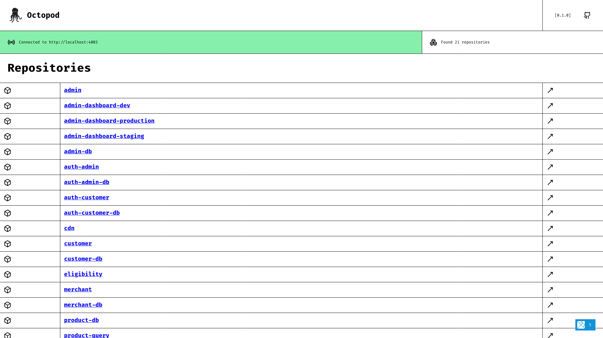
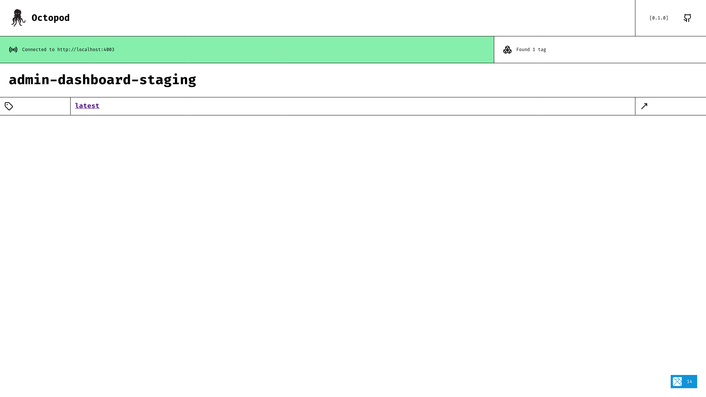
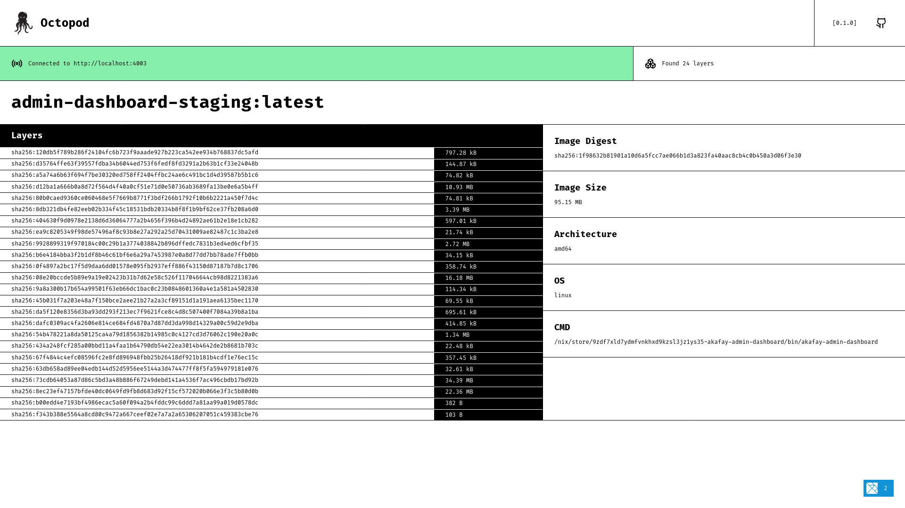

# Octopod

A UI for Docker Registries

```
A UI for Docker Registries

Usage: octopod [OPTIONS] --registry-url <REGISTRY_URL>

Options:
      --address <ADDRESS>
          The address to bind to [env: ADDRESS=] [default: 127.0.0.1:3030]
      --registry-url <REGISTRY_URL>
          Registry URL to connect to. Example [http://127.0.0.1:3030] [env: REGISTRY_URL=]
      --registry-credentials <REGISTRY_CREDENTIALS>
          Registry username and password separated with a colon. Example [username:password] [env: REGISTRY_CREDENTIALS=]
  -h, --help
          Print help
  -V, --version
          Print version
```

## Run it with Docker

```
docker run -p 3030:3030 \
      -e ADDRESS="0.0.0.0:3030" \
      -e REGISTRY_URL="<registry_url>" \
      -e REGISTRY_CREDENTIALS="<username>:<password>" \
      frectonz/octopod
```

## Install

### Linux and MacOS

```
curl --proto '=https' --tlsv1.2 -LsSf https://github.com/frectonz/octopod/releases/download/0.1.2/octopod-installer.sh | sh
```

### Windows

```
powershell -ExecutionPolicy ByPass -c "irm https://github.com/frectonz/octopod/releases/download/0.1.2/octopod-installer.ps1 | iex"
```

### Nix

```
nix run github:frectonz/octopod
```

## Screenshots

### Repositories Page


### Tags Page


### Image Page

